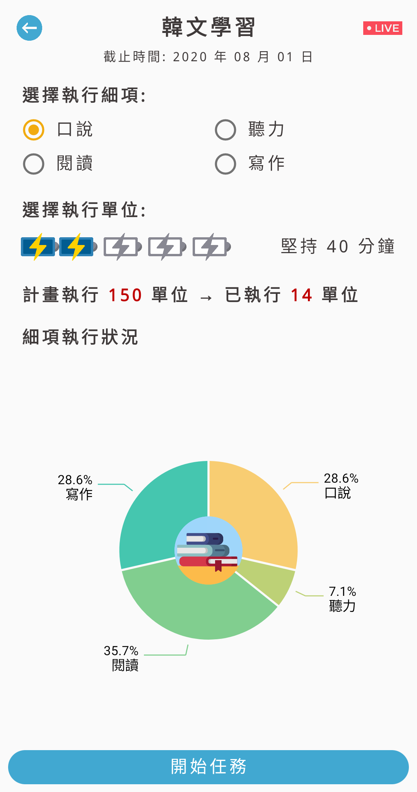
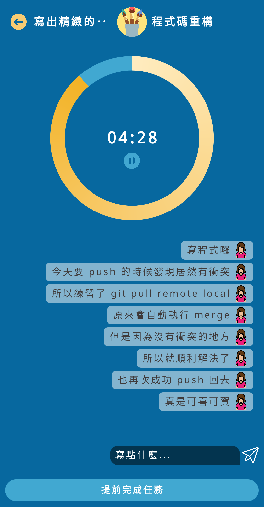
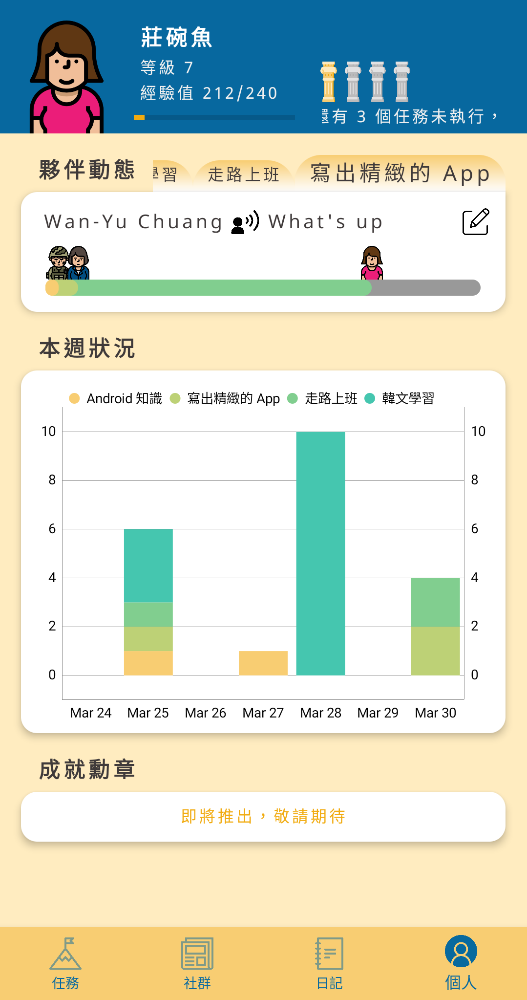
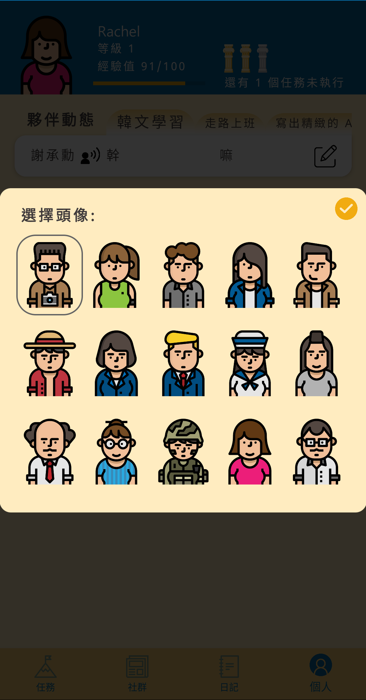

# LiTsap
協助使用者完成所設立的目標，並可將任務達成狀況發佈於 LiTsap 社群中 :coffee:

## Motivation 開發動機
忙碌生活中，常不自覺陷入心流而忘記時間的流逝，

此 App 用意在於協助使用者在執行目標時可定時每20分鐘休息一下轉換心境、伸伸懶腰、上個廁所等，以保持身體健康。

建立任務時也自動加入同任務類型群組，可彼此鼓勵加油打氣朝目標邁進。

### User Manual 操作介紹:
1. 使用 Facebook 或 Google 第三方登入以註冊 LiTsap 帳號

2. 點按左下角頁面新增任務項目，包含: 任務名稱、任務類別、細項、截止日期及執行次數

3. 選按主頁面已建立之任務進入任務資訊頁面, 選擇欲執行細項與時間後可再進入執行頁面

4. 在執行頁面中可暫停倒數計時器，撰寫小筆記

5. 完成任務時可撰寫該次執行心得並領取經驗值

6. 社群頁面可看已完成任務者其心得分享，點按可觀看內容

7. 日記頁面可查詢每日已執行並留下足跡之任務

8. 個人頁面可看累積點數, 群組夥伴執行任務之心情狀態及過去七日執行任務狀況; 選擇頭像可做更換

</img>     </img> 
</img> 
</img>     </img>   </img>     </img>     </img> </img>     </img>     </img> </img>

### Implementations 實作技術與工具:
Design Patterns - MVVM, Factory, Adapter, Singleton, Observer

Jetpack - ViewModel, Navigation, LiveData, Data Binding, Permissions, Lifecycles, ViewPager, Media, Fragment

Firebase - Firestore, Firebase Authentication, Firebase Storage, Crashlytics

Third Parties - Glide, Moshi, MPAndroidChart, Wasabeef

Test - JUnit

### Requirement 環境需求:
Android SDK 26+

Google Play Release 2.3.3 (2020/03/16)

Contact 聯絡資訊 honidot.studio@gmail.com
